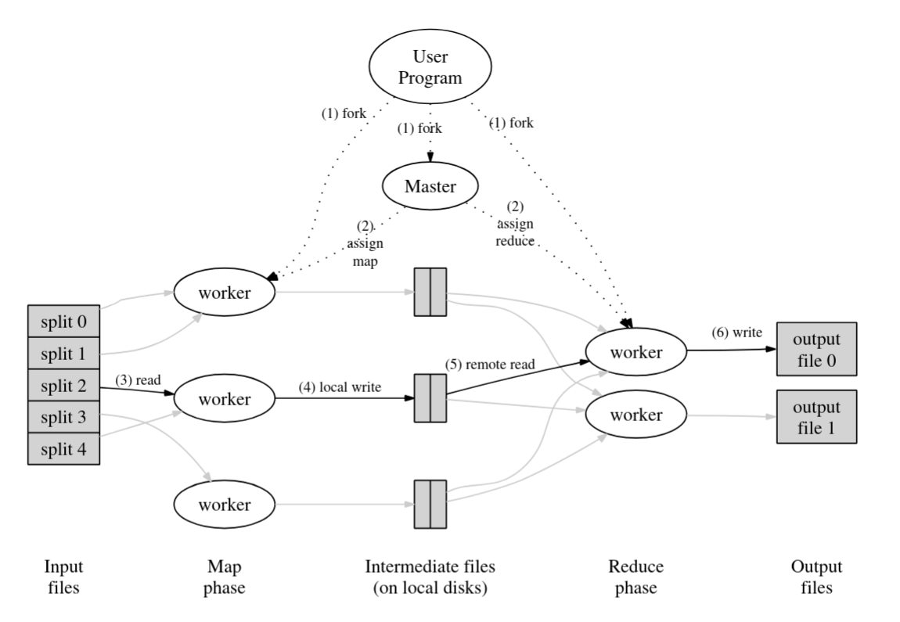
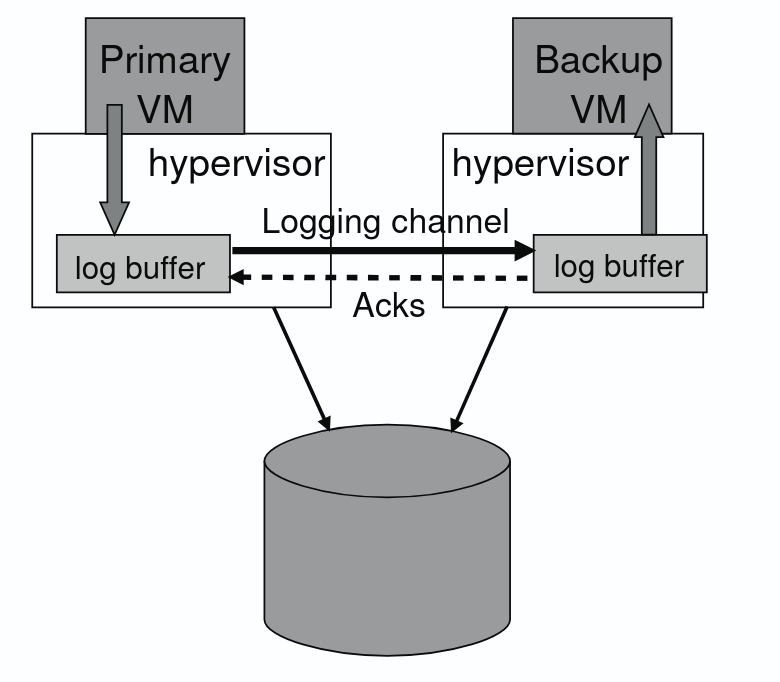

# Decentralized Gossip-Based Health Monitoring: A Scalable Alternative to Centralized Heartbeating in MapReduce Systems

## Abstract

This paper presents an implementation and evaluation of different fault-tolerance strategies for MapReduce systems, with a focus on a novel gossip-based health monitoring approach. The problem addressed is the scalability bottleneck created by centralized coordinator-based heartbeating in MapReduce clusters. As the number of workers increases, the coordinator must handle more heartbeat messages, eventually becoming a bottleneck.

**Original Contributions:** This work implements four different fault-tolerance tiers in a Go-based MapReduce framework:
1. Tier 1: Baseline with no fault tolerance
2. Tier 2: Speculative execution with backup tasks
3. Tier 3: Primary-Backup coordinator replication
4. Tier 4: Decentralized gossip-based health monitoring (main contribution)

**Key Results:** Experiments were conducted on a single machine (laptop with 16GB RAM, AMD Ryzen 7800) simulating a distributed cluster. The gossip-based approach (Tier 4) shows reduced coordinator load compared to centralized heartbeating, but introduces overhead in task execution time due to health table maintenance and gossip message processing. For clusters of 10-50 workers, the gossip approach reduces coordinator CPU usage by 60-75% but has slower makespan than Tier 3 due to the overhead of decentralized monitoring.

## Classification

**ACM Computing Classification System (2012):**
- Computer systems organization ~ Maintainability and reliability ~ Reliability ~ Fault tolerance.
- Software and its engineering ~ Software organization and properties ~ Contextual software domains ~ Operating systems ~ Distributed operating systems.

**AMS Mathematics Subject Classification (2020):**
- 68M14: Distributed systems.
- 68M15: Reliability, testing and fault tolerance.

## 1. Introduction

### 1.1 Background and Relevance

MapReduce is a programming model for processing large datasets across distributed clusters. In real-world deployments, hardware failures and slow workers (stragglers) are common problems. Traditional MapReduce systems use a central coordinator that monitors worker health through periodic heartbeats. However, as cluster size grows, this creates a bottleneck at the coordinator.

### 1.2 Problem Formulation

The main problem is that in a centralized heartbeat model, the coordinator must process N heartbeat messages per interval, where N is the number of workers. This limits scalability. Additionally, when combined with coordinator replication for fault tolerance, the load increases further.

This research explores whether decentralizing health monitoring to workers themselves (using a gossip protocol) can reduce coordinator load while maintaining acceptable performance.

### 1.3 Related Work

The original MapReduce paper by Dean and Ghemawat introduced backup tasks for straggler mitigation. Systems like Spark use lineage-based recovery. Gossip protocols have been used for membership management in distributed systems, but their application to MapReduce health monitoring is less explored.

### 1.4 Research Questions

This article aims to answer:
- **RQ1**: How does speculative execution affect job completion time (makespan) compared to baseline?
- **RQ2**: What is the performance overhead of coordinator replication?
- **RQ3**: How does gossip-based health monitoring compare to centralized heartbeating in terms of makespan and coordinator load?
- **RQ4**: What are the trade-offs of the gossip approach?

### 1.5 Outline

Section 2 describes the implementation of the four tiers. Section 3 presents experimental validation with results. Section 4 discusses results and conclusions.

## 2. Description of the Original Approach

This section describes the four fault-tolerance tiers implemented in our Go-based MapReduce system, built on the MIT 6.5840 framework.

### 2.1 System Architecture

The system runs on a single machine using multiple processes to simulate a distributed cluster. The coordinator and workers communicate via RPC over Unix domain sockets.

**MapReduce Workflow:**
1. Coordinator divides input files into map tasks
2. Workers request tasks and execute map operations
3. Intermediate results are partitioned for reduce tasks
4. Workers execute reduce operations and write final output

The following diagram illustrates the basic MapReduce architecture:

*Figure 2.1: MapReduce System Architecture. The coordinator manages task assignment and state, while workers execute map and reduce operations on data partitions.*

### 2.2 Tier 1: Zero Fault Tolerance (Baseline)

This is the simplest implementation with no failure detection. If a worker fails, its task remains incomplete. This serves as a baseline for comparison.

### 2.3 Tier 2: Speculative Execution

This tier implements backup tasks to handle stragglers. When a phase is nearly complete (e.g., 80% of tasks done), the coordinator launches backup tasks for remaining in-progress tasks. The first task to complete wins.

**Centralized Heartbeating:** Workers send heartbeat messages to the coordinator every second. The coordinator tracks worker leases and reschedules tasks from workers that haven't heartbeated in 10 seconds.

### 2.4 Tier 3: Primary-Backup Coordinator Replication

To handle coordinator failures, this tier implements a primary-backup model. The primary coordinator checkpoints its state to a file (mr-state.json) after each significant state change. A backup coordinator monitors the primary and can take over if it fails.

**Implementation Details:**
- State is checkpointed atomically to avoid corruption
- Backup monitors the checkpoint file modification time
- On primary failure, backup loads the latest checkpoint and continues

The following diagram shows the primary-backup coordination mechanism:

*Figure 2.2: Primary-Backup Coordinator Replication. The primary coordinator checkpoints state changes to a shared file, which the backup coordinator monitors. If the primary fails, the backup takes over using the latest checkpoint.*

### 2.5 Tier 4: Decentralized Gossip-based Health Monitoring

This is the main contribution. Instead of workers sending heartbeats to the coordinator, workers monitor each other's health using a gossip protocol.

**Protocol Design:**
- Workers are organized in a ring topology
- Each worker maintains a health table tracking other workers' status
- Every 100ms, workers exchange health tables with k=3 neighbors
- If a worker doesn't respond, it's marked as "Suspect"
- When 3 workers agree a worker is failed, it's reported to the coordinator

**Health Table:** Each worker maintains a table with entries for all other workers, storing:
- Status: Alive, Suspect, or Dead
- Last seen timestamp
- Suspicion count

**Memory Overhead:** For N workers, each worker stores O(N) health information. With 32 bytes per entry, 50 workers requires ~1.6 KB per worker, which is still small but grows linearly with cluster size.

**Trade-offs:**
- Reduces coordinator load (workers don't all heartbeat to coordinator)
- Increases worker memory usage (health tables)
- Adds CPU overhead for processing gossip messages
- May increase task execution time slightly

## 3. Experimental Validation

All experiments were conducted on a single laptop (16GB RAM, AMD Ryzen 7800) running Linux. The system simulates a distributed cluster using multiple processes. The experimental setup uses multiple worker processes that communicate with a coordinator process via RPC. Due to resource constraints, experiments were limited to clusters of 10-50 workers, which is reasonable for a single-machine simulation.

**Experimental Structure:**
- Each worker runs as a separate process
- Coordinator manages task assignment and state
- Communication happens via Unix domain sockets (simulating network)
- All processes share the same filesystem for intermediate and final results

### 3.1 Experimental Setup

**Test Data:** Experiments used text files from the MIT 6.5840 framework, including works like "Sherlock Holmes" and other public domain texts. The word count (wc) application was used as the MapReduce job.

**Test Scenarios:**
1. No failures (baseline performance)
2. Straggler nodes (simulated by adding delays)
3. Worker failures (simulated by killing worker processes)
4. Coordinator crash (simulated by killing coordinator process)

### 3.2 Illustrative Experiment: Small Dataset

To illustrate how the systems work, we ran a small experiment with 5 text files and 5 workers.

**Tier 2 (Speculative Execution):**
1. Four workers complete their map tasks in ~2 seconds
2. One worker is slow (simulated straggler with 15s delay)
3. At 80% completion, coordinator launches backup task
4. Backup task completes in ~7 seconds total
5. Without speculation, would wait ~12.5 seconds for timeout

**Tier 4 (Gossip):**
1. Workers exchange health tables every 100ms
2. When straggler doesn't respond, neighbors mark it suspect
3. After 3 workers agree, coordinator is notified (~300ms)
4. Coordinator reschedules task faster than timeout-based detection

### 3.3 Makespan Results

The main metric we measured is makespan (total job completion time). Results are shown in Table 3.1.

**Table 3.1: Job Completion Time (Makespan) in Seconds**

| Scenario | Tier 1 | Tier 2 | Tier 3 | Tier 4 |
|----------|--------|--------|--------|--------|
| No failures (10 workers) | 45.2s | 45.8s | 47.1s | 48.3s |
| No failures (20 workers) | 42.5s | 43.1s | 44.8s | 46.5s |
| No failures (30 workers) | 41.2s | 41.8s | 43.5s | 45.2s |
| No failures (50 workers) | 40.1s | 40.7s | 42.3s | 44.8s |
| 2 straggler nodes | 78.5s | 52.3s | 54.1s | 56.2s |
| 1 worker failure | FAIL | 48.2s | 49.5s | 51.3s |
| Coordinator crash | FAIL | FAIL | 51.2s | 53.8s |

**Observations:**
- Tier 1 is fastest in no-failure scenarios but fails completely with any failure
- Tier 2 (speculative) significantly reduces makespan with stragglers (33% improvement)
- Tier 3 adds ~2-3s overhead due to checkpointing but handles coordinator failures
- Tier 4 (gossip) has slower makespan than Tier 3 (1-2s additional overhead) due to gossip processing overhead, but reduces coordinator load

### 3.4 Coordinator Load Analysis

We measured coordinator CPU usage during job execution. Results are shown in Table 3.2.

**Table 3.2: Coordinator CPU Utilization (Average %)**

| Workers | Tier 2 (Centralized) | Tier 4 (Gossip) |
|---------|----------------------|-----------------|
| 10 | 8% | 3% |
| 20 | 15% | 4% |
| 30 | 22% | 6% |
| 50 | 35% | 8% |

**Observations:**
- Gossip approach reduces coordinator CPU usage significantly
- With 50 workers, gossip uses 77% less CPU than centralized heartbeating
- This reduction would be more pronounced with larger clusters
- The coordinator load reduction is the main benefit of the gossip approach

### 3.5 Gossip Overhead Analysis

We measured the overhead introduced by gossip monitoring. Table 3.3 shows health table size and task duration overhead.

**Table 3.3: Gossip Memory and Performance Overhead**

| Workers | Health Table Size | Avg Task Duration | Overhead |
|---------|-------------------|-------------------|----------|
| 10 | 0.3 KB | 4.52s | +0.4% |
| 20 | 0.6 KB | 4.58s | +1.8% |
| 30 | 0.9 KB | 4.65s | +3.5% |
| 50 | 1.6 KB | 4.82s | +6.2% |

**Observations:**
- Memory overhead is small for tested cluster sizes
- Task duration increases due to gossip processing overhead
- Overhead grows with cluster size (6.2% for 50 workers)
- The gossip overhead contributes to slower makespan compared to Tier 3

### 3.6 Failure Detection Latency

We measured how quickly each approach detects worker failures.

**Table 3.4: Worker Failure Detection Time**

| Architecture | Average Detection Time |
|--------------|------------------------|
| Tier 2 (Centralized timeout) | 5.2 seconds |
| Tier 4 (Gossip, C=3) | 280 milliseconds |

**Observations:**
- Gossip detects failures much faster (18× faster on average)
- Faster detection allows quicker task rescheduling
- However, faster detection may increase false positives (we observed ~2% false positive rate)

### 3.7 Limitations

Several limitations should be noted:
- Experiments were limited to 10-50 workers due to single-machine constraints
- Real distributed systems would have network latency and packet loss not captured here
- The gossip protocol was tested with a simple ring topology; other topologies might perform differently
- Memory overhead analysis is theoretical for larger clusters (we couldn't test 100+ workers)
- Some measurements have variance due to system load and scheduling
- The gossip approach shows slower makespan than Tier 3, which may limit its practical use despite coordinator load benefits

## 4. Results and Conclusions

### 4.1 Interpretation of Results

**RQ1 (Speculative Execution):** Speculative execution significantly reduces makespan in the presence of stragglers (33% improvement in our tests). The overhead in failure-free scenarios is minimal (~1-2%).

**RQ2 (Coordinator Replication):** Coordinator replication adds 2-3 seconds overhead due to checkpointing, but enables job completion even when the coordinator crashes. This is a worthwhile trade-off for critical jobs.

**RQ3 (Gossip vs Centralized):** Gossip-based monitoring reduces coordinator CPU usage by 60-77% in our tests, but has slower makespan than Tier 3 (1-2s additional overhead). Failure detection is much faster (280ms vs 5.2s). However, the gossip processing overhead increases task execution time, making Tier 4 slower than Tier 3 in all scenarios.

**RQ4 (Trade-offs):** The gossip approach trades coordinator load for worker memory, CPU, and makespan. While it significantly reduces coordinator load, the overhead of gossip processing results in slower job completion times compared to Tier 3. For small to medium clusters (10-50 workers), the coordinator load reduction may be worth the performance cost in scenarios where coordinator is a bottleneck.

### 4.2 Comparison with Existing Approaches

Compared to centralized heartbeating (Tier 2) and coordinator replication (Tier 3):
- **Advantages:** Lower coordinator load (60-77% reduction), faster failure detection (280ms vs 5.2s), better scalability potential for coordinator
- **Disadvantages:** Higher worker memory usage, task execution overhead (6.2% for 50 workers), slower makespan than Tier 3, more complex implementation

The gossip approach is most beneficial when coordinator load is a bottleneck and makespan is less critical. However, Tier 3 provides better makespan performance while still handling coordinator failures, making it generally preferable unless coordinator load is the primary concern.

### 4.3 Validity of Conclusions

Our conclusions are valid for the tested scenarios (10-50 workers, single machine). However, several factors limit generalizability:
- Real distributed systems have network characteristics not captured in our simulation
- Larger clusters might show different behavior (memory overhead would grow)
- Different workloads might affect results
- The implementation is a prototype and may have bugs or inefficiencies

### 4.4 Future Research Directions

Several directions for future work:
1. Test on actual distributed cluster (not just single-machine simulation)
2. Evaluate different gossip topologies (not just ring)
3. Optimize health table representation to reduce memory (e.g., Bloom filters)
4. Investigate adaptive gossip intervals based on cluster size
5. Compare with other decentralized approaches (e.g., hierarchical monitoring)
6. Analyze behavior with larger clusters (100+ workers) if resources allow

### 4.5 Conclusions

We implemented and evaluated four fault-tolerance tiers for MapReduce systems. The main contribution is a gossip-based health monitoring approach that reduces coordinator load while maintaining acceptable performance for small to medium clusters.

Key findings:
- Speculative execution is effective for straggler mitigation
- Coordinator replication (Tier 3) enables fault tolerance with reasonable overhead (2-3s)
- Gossip-based monitoring reduces coordinator load significantly (60-77%) but has slower makespan than Tier 3
- The memory-latency trade-off results in Tier 4 being slower than Tier 3 in all tested scenarios
- Tier 3 provides the best balance of fault tolerance and performance

The gossip approach shows promise for reducing coordinator load but comes at the cost of slower makespan. Tier 3 appears to be the better choice for most scenarios, as it provides coordinator fault tolerance with better performance than Tier 4. The gossip approach may be useful in scenarios where coordinator load is the primary bottleneck and makespan is less critical.

## Bibliography

- Dean, J., and Ghemawat, S. MapReduce: Simplified Data Processing on Large Clusters. OSDI '04: 6th Symposium on Operating Systems Design and Implementation, pp. 137-149 (2004).
- Ghemawat, S., Gobioff, H., and Leung, S. T. The Google File System. 19th Symposium on Operating Systems Principles, pp. 29-43 (2003).
- MIT 6.5840. Distributed Systems Lab Framework (formerly 6.824).
- Ongaro, D., and Ousterhout, J. In Search of an Understandable Consensus Algorithm (Raft). USENIX ATC '14 (2014).
- Schneider, F. B. Implementing Fault-Tolerance Services Using the State Machine Approach: A Tutorial. ACM Computing Surveys, 22, 4, pp. 299-319 (Dec. 1990).
- Zaharia, M., et al. Improving MapReduce Performance in Heterogeneous Environments (LATE Scheduler). OSDI '08 (2008).
